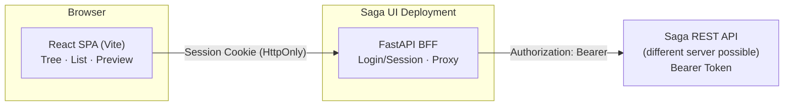
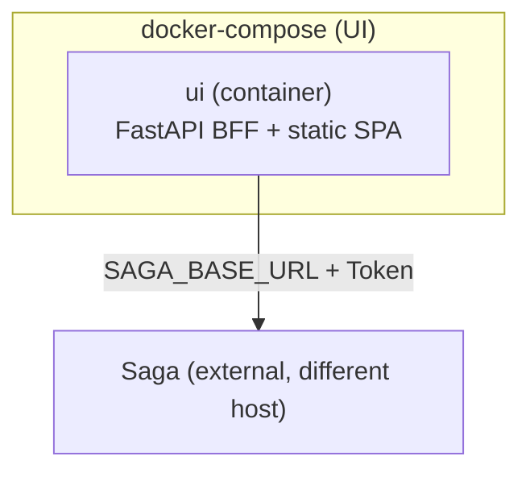

# Architecture – Saga UI

> Status: Draft v1. Describes the **how** for the functional requirements in
> [`01-functional-requirements.md`](01-functional-requirements.md).

---

## 1. Overview

The Saga UI consists of two components that are deployed together but communicate
with Saga over the network:

1. **Frontend (SPA)** — React + TypeScript, built with Vite. A pure browser application;
   talks only to the BFF.
2. **BFF (Backend-for-Frontend)** — FastAPI (Python). Encapsulates login / session,
   keeps the Saga Bearer token server-side, and proxies API calls to Saga.



### Why BFF + Vite SPA (instead of direct access or Next.js)
- **BFF** solves three problems at once: (a) static username/password login, (b)
  Bearer token confidentiality, (c) bypassing the missing CORS in Saga. Saga
  remains unchanged and can run on any host.
- **FastAPI** as BFF fits the Python ecosystem of Saga (same language, easy reuse
  of knowledge and tooling, async HTTP proxy with `httpx`).
- **Vite SPA** instead of Next.js: no SSR needed (internal tool UI), leaner build,
  clear frontend/backend separation. The SPA is built as static files and served by
  the BFF (or a reverse proxy).

---

## 2. Components

### 2.1 Frontend (React / Vite / TypeScript)
- **Build / Tooling:** Vite, TypeScript, ESLint + Prettier.
- **UI component library:** Mantine (modern design system with `Tree`, `AppShell`,
  `Dropzone`, Notifications, light/dark mode) – good accessibility and best-practice
  coverage. (Alternative: MUI; decision documented, easily swappable.)
- **Data layer:** TanStack Query for fetching, caching, status polling and optimistic
  updates.
- **Routing:** React Router (login, main view, document detail).
- **Preview:**
  - PDF: `react-pdf` (based on PDF.js).
  - Images: native `` via BFF stream.
  - Markdown: `react-markdown` (+ sanitisation) for `content_markdown`.
- **API client:** Types derived from the Saga OpenAPI schema (`/openapi.json`),
  wrapped in a client that exclusively calls BFF routes.

### 2.2 BFF (FastAPI)
- **Responsibilities:**
  - `POST /api/auth/login` / `POST /api/auth/logout` / `GET /api/auth/me` –
    static login, session creation / invalidation.
  - **Proxy routes** `/* → Saga`: attach the Bearer token, forward status codes /
    bodies (including streaming for `/file`). Protected by session guard.
  - `GET /health` – liveness + optional Saga reachability check.
- **Session:** Server-side session via signed HttpOnly cookies (`itsdangerous`
  `URLSafeTimedSerializer`). v1: signed cookie is sufficient.
- **HTTP client:** `httpx.AsyncClient` with connection pooling and timeouts.
- **Configuration:** exclusively via environment variables (see §5).

---

## 3. Data Flow (Examples)

**Login:** Browser → `POST /api/auth/login` (user/pass) → BFF validates against
`UI_USERNAME`/`UI_PASSWORD` (constant-time) → sets session cookie → SPA shows main view.

**Load tree:** SPA → `GET /api/categories/tree` → BFF (session ok) →
`GET {SAGA}/categories/tree` with Bearer → response to SPA → Mantine `Tree`.

**PDF preview:** SPA → `GET /api/documents/{id}/file` → BFF streams
`GET {SAGA}/documents/{id}/file` through → `react-pdf` renders.

**Upload:** SPA (multipart) → `POST /api/documents` → BFF forwards stream →
`202` → SPA polls `GET /api/documents/{id}/status` until `ready`/`failed`.

---

## 4. API Mapping (BFF Route → Saga Endpoint)

| BFF Route | Saga Endpoint | Purpose |
|-----------|-------------------|---------|
| `POST /api/auth/login` | – (local) | Static login |
| `POST /api/auth/logout` | – (local) | Logout |
| `GET /api/auth/me` | – (local) | Check session |
| `GET /api/health` | `GET /health` | Reachability |
| `GET /api/documents` | `GET /documents` | List |
| `POST /api/documents` | `POST /documents` | Upload |
| `GET /api/documents/{id}` | `GET /documents/{id}` | Detail + `content_markdown` |
| `GET /api/documents/{id}/status` | `GET /documents/{id}/status` | Status |
| `GET /api/documents/{id}/file` | `GET /documents/{id}/file` | Preview / download (stream) |
| `PUT /api/documents/{id}` | `PUT /documents/{id}` | Replace |
| `DELETE /api/documents/{id}` | `DELETE /documents/{id}` | Delete |
| `POST /api/search` | `POST /search` | Hybrid search |
| `GET /api/categories/tree` | `GET /categories/tree` | Category tree |
| `GET /api/categories/{path}/documents` | `GET /categories/{path}/documents` | Documents per category |

> Note: `/export/documents` is not needed by UI v1 (backup functionality).

---

## 5. Configuration (BFF Environment Variables)

| Variable | Description | Example |
|----------|-------------|---------|
| `SAGA_BASE_URL` | Saga API base URL | `http://saga-host:8000` |
| `SAGA_API_TOKEN` | Bearer token for Saga | `*****` |
| `UI_USERNAME` | Static login username | `admin` |
| `UI_PASSWORD` | Static login password | `*****` |
| `SESSION_SECRET` | Key for signing session cookies | `*****` |
| `SESSION_MAX_AGE` | Session lifetime in seconds | `28800` |
| `MAX_UPLOAD_BYTES` | Client / server upload limit | `104857600` |
| `LOG_LEVEL` | BFF log level | `INFO` |
| `CORS_ALLOW_ORIGINS` | Only if frontend is hosted on a separate origin | – |

In single-container operation the BFF serves the static frontend files; same-origin
means no CORS configuration is needed.

---

## 6. Security Design

- Bearer token only in the BFF (UI-NFR-5). The browser sees only the session cookie.
- Cookies: `HttpOnly` + `SameSite` + `Secure` (when served over HTTPS).
- CSRF protection for state-changing routes (SameSite + optional CSRF token).
- Login rate limiting; no passwords in logs.
- The BFF forwards Saga error envelopes (`code`/`message`) transparently without
  leaking internal details.

---

## 7. Deployment



- **Build:** Multi-stage Dockerfile – stage 1 builds the SPA (Node), stage 2 the Python
  BFF which serves the built assets statically.
- **Compose:** `docker-compose.yml` starts only the UI container; Saga is referenced
  via `SAGA_BASE_URL` (can be local or remote).
- **Reverse proxy (optional):** TLS termination in front of the BFF (e.g. Traefik /
  Nginx).

---

## 8. Directory Structure

```
saga-ui/
├─ docs/                      # Requirements, architecture, plan, API gaps
├─ frontend/                  # React + Vite + TS
│  ├─ src/
│  │  ├─ api/                 # BFF API client + typed functions
│  │  ├─ components/          # Tree, list, detail, preview, login
│  │  ├─ pages/
│  │  ├─ hooks/
│  │  └─ lib/
│  ├─ index.html
│  └─ vite.config.ts
├─ bff/                       # FastAPI BFF
│  ├─ app/
│  │  ├─ main.py
│  │  ├─ auth.py
│  │  ├─ proxy.py
│  │  ├─ config.py
│  │  └─ saga_client.py
│  └─ pyproject.toml
├─ docker/Dockerfile
├─ docker-compose.yml
├─ .env.example
├─ AGENTS.md
└─ README.md
```

---

## 9. Open / Dependent Items

- Title / metadata filter search and manual re-categorisation require Saga
  extensions – documented as optional in [`../api-gaps.md`](../api-gaps.md).
- Exact session mechanism (signed cookie vs. server-side store) was finalised in
  step 2 of the plan: **signed `URLSafeTimedSerializer` cookie** is used.
